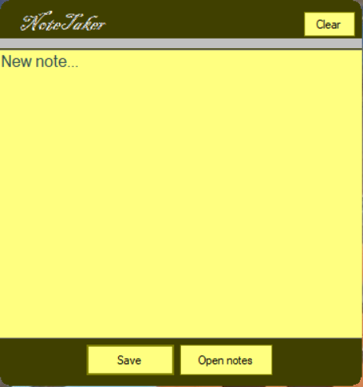

# CubeSolvesTimer

App description: User can use this app to test how fast can s/he solve the rubik's cube

*IMPORTANT NOTE: Please add from the tray icon this app to the start-up menu

App description:

The main idea of this application is to resemble to the Windows 7 gadgets
	-App start-up with Windows.
	-App store notes in order of numbers (1),2),3),4)...) in a text file named "Notes", if it doesn't exit then the app create it in the user's desktop.
	-App re-organize the oder of numbers (numéritaion) in order if the user remove a note, so instead of [ 1) First note, 3) Third note] to [ 1) First note, 2) Third note].
	-App's icon is shown in Windows tray which allow the user to:
		*Open the "notes" text file.
		*Exit the app.
		*Add the app to the start-up menu.
	-App's icon doesn"t show in the taskbar.
	-The app notification informs the user of the number of notes stored in the "notes" text file.

App's interface toolbox:
	-Button: Clear the text input area.
	-Button: Save the input in the text file.
	-Button: Open the "notes" text file.
	-Textbox: An area to write.
	-Label: Displays fast a text of "Note taken" when the user saves a note.

App's features:
	-The textbox always shows "New note...", even when the user clicks away and move away the mouse from the text area IF it's empty. Else the user's input isn't changed